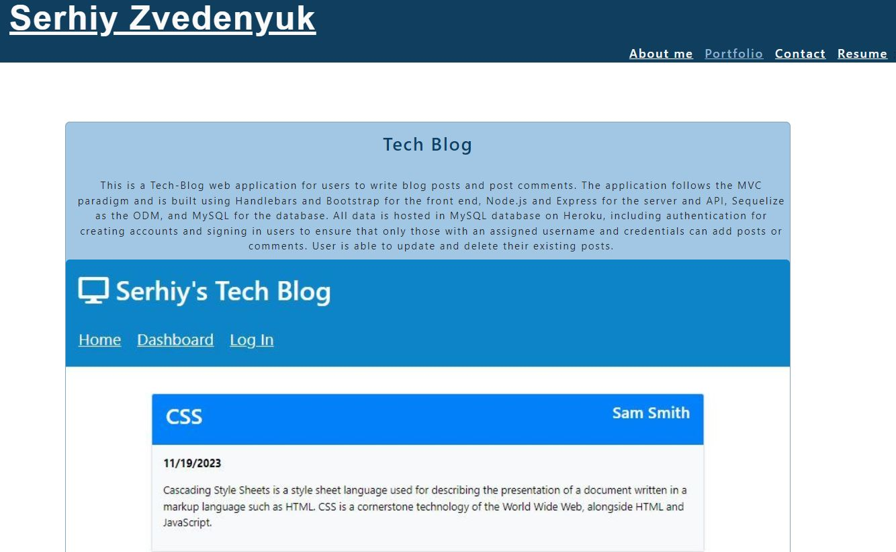

# React Portfolio


## Table of Contents

* [Project Overview](#Overview)
* [Languages Used](#Languages)
* [Libraries Used](#Libraries)
* [Installation](#Installation)
* [Live Application](#live-application)
* [License](#License)


## Overview

This is a simple client-side portfolio application built using React.js to display the latest work samples with dynamically rendered HTML.  React Router is used to render page components and change URLs to match without reloading the page.

## Languages

* JavaScript (React)
* HTML
* CSS

## Libraries

* [React](https://www.npmjs.com/package/react)
* [React DOM](https://www.npmjs.com/package/react-router-dom)
* [Bootstrap](https://www.npmjs.com/package/bootstrap)

## Installation

To run this application on your local machine, Node.js is _required_. Once cloned/downloaded from GitHub, enter ```npm i``` in command line to install the packages referenced under Libraries Used automatically. You are now be ready to launch the application by entering ```npm start```.

## Live Application


## License

MIT License

Copyright (c) 2023 SerhiyZv

Permission is hereby granted, free of charge, to any person obtaining a copy of this software and associated documentation files (the "Software"), to deal in the Software without restriction, including without limitation the rights to use, copy, modify, merge, publish, distribute, sublicense, and/or sell copies of the Software, and to permit persons to whom the Software is furnished to do so, subject to the following conditions:

The above copyright notice and this permission notice shall be included in all copies or substantial portions of the Software.

THE SOFTWARE IS PROVIDED "AS IS", WITHOUT WARRANTY OF ANY KIND, EXPRESS OR IMPLIED, INCLUDING BUT NOT LIMITED TO THE WARRANTIES OF MERCHANTABILITY, FITNESS FOR A PARTICULAR PURPOSE AND NONINFRINGEMENT. IN NO EVENT SHALL THE AUTHORS OR COPYRIGHT HOLDERS BE LIABLE FOR ANY CLAIM, DAMAGES OR OTHER LIABILITY, WHETHER IN AN ACTION OF CONTRACT, TORT OR OTHERWISE, ARISING FROM, OUT OF OR IN CONNECTION WITH THE SOFTWARE OR THE USE OR OTHER DEALINGS IN THE SOFTWARE.

## Screenshots




